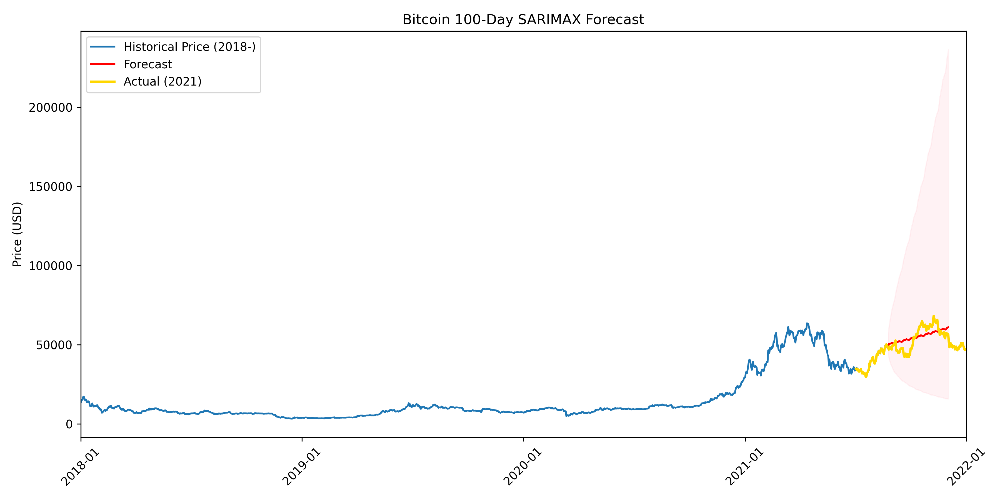

# Forecasting Major Cryptocurrency Prices with SARIMAX

This project explores forecasting methods for major cryptocurrencies (Bitcoin, Ethereum, Solana) using SARIMAX, combined with signal-processing (Fourier filtering) and exogenous regressors (S&P 500 returns).

## Methods
- Preprocessed daily crypto prices and S&P 500 data (2018–2021)
- Applied Fourier-based noise filtering to remove high-frequency fluctuations
- Built SARIMAX models with exogenous variables to forecast 10–100 day horizons
- Compared performance with baseline ARIMA

## Results
- SARIMAX improved short-horizon forecasts compared to ARIMA
- Exogenous S&P 500 returns reduced forecast error
- Confidence intervals captured realized outcomes within 95% bounds

## Files
- `notebook.ipynb` – Python implementation
- `docs/Forecasting_Major_Cryptocurrency_Prices_with_SARIMAX.pdf` – final presentation/report
- `figures/` – forecast plots

## Key Takeaways
- Fourier filtering improves model stability
- Exogenous regressors (e.g. S&P 500) enhance accuracy
- Practical implications for crypto risk management & trading
